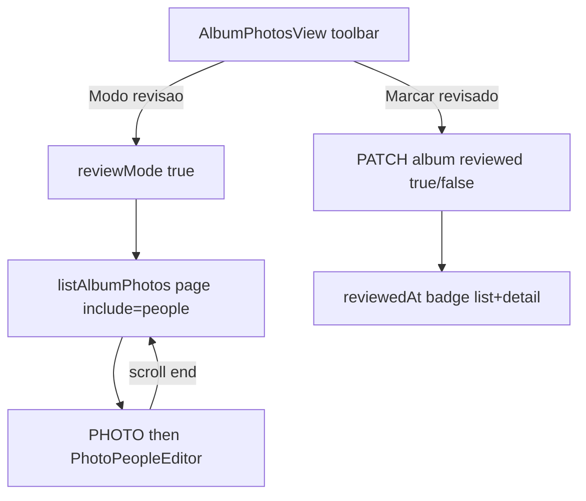

# Album review mode

**Goal:** On admin album detail, toggle review mode (large photo → editable people list, infinite scroll) and mark album reviewed in DB.

**Architecture:** Same-page mode on [`AlbumPhotosView.vue`](apps/web/src/views/admin/AlbumPhotosView.vue) (like `reorderMode`). Backend adds `reviewedAt` on Album; admin photo list accepts `include=people` for chunked loads. Extract [`PhotoPeopleEditor.vue`](apps/web/src/components/admin/PhotoPeopleEditor.vue) from photo editor for reuse.

**Tech:** Symfony/Doctrine + Vue 3 + existing `adminApi` people endpoints.

## Files

| Area | Touch |
|------|--------|
| Entity + migration | [`Album.php`](apps/api/src/Entity/Album.php), new `Version20260906220000.php` |
| Album API | [`AlbumController.php`](apps/api/src/Controller/Api/Admin/AlbumController.php) `normalize` + `applyPayload` |
| Photo list API | [`PhotoUploadController.php`](apps/api/src/Controller/Api/Admin/PhotoUploadController.php) `list` + `normalize`; eager-load faces/person when `include=people` |
| Types/client | [`types.ts`](apps/web/src/api/types.ts), [`client.ts`](apps/web/src/api/client.ts) |
| Shared UI | new `PhotoPeopleEditor.vue`; slim [`PhotoEditView.vue`](apps/web/src/views/admin/PhotoEditView.vue) |
| Review UI | [`AlbumPhotosView.vue`](apps/web/src/views/admin/AlbumPhotosView.vue) |
| Badge | [`AlbumsView.vue`](apps/web/src/views/admin/AlbumsView.vue) |
| Tests | API PHPUnit + Vue specs |

## Task 1 — `reviewedAt` API

- Add nullable `reviewedAt` on Album (get/set).
- Migration: `ALTER TABLE album ADD reviewed_at TIMESTAMP(0) WITHOUT TIME ZONE DEFAULT NULL`.
- `normalize`: `'reviewedAt' => $album->getReviewedAt()?->format(\DATE_ATOM)`.
- `applyPayload`: if `array_key_exists('reviewed', $payload)`:
  - `true` → `setReviewedAt(new \DateTimeImmutable())`
  - `false` → `setReviewedAt(null)`
  - else 400.
- Types: `AdminAlbum.reviewedAt: string | null`; `AlbumWritePayload.reviewed?: boolean`.
- Test: PATCH on/off; list/show include `reviewedAt`.

## Task 2 — `include=people` on album photo list

- In [`PhotoUploadController::list`](apps/api/src/Controller/Api/Admin/PhotoUploadController.php): read `include` query; if `people`, attach people via same logic as [`PhotoController::normalizePeople`](apps/api/src/Controller/Api/Admin/PhotoController.php) (copy private helper or tiny shared trait — prefer copy 15 lines over new abstraction).
- Eager-load faces+person for that page to avoid N+1 (join in repo method or `initialize` after fetch).
- Default list unchanged (no `people` key).
- `AdminPhotoSummary.people?: PersonSummary[]`; `listAlbumPhotos(..., { include?: 'people' })`.
- Test: with/without include.

## Task 3 — `PhotoPeopleEditor`

- Extract search/add/create/remove UI + logic from PhotoEditView into [`apps/web/src/components/admin/PhotoPeopleEditor.vue`](apps/web/src/components/admin/PhotoPeopleEditor.vue).
- Props: `photoId: string`, `people: PersonSummary[]`; emit `update:people`.
- Keep existing `data-testid`s so PhotoEditView specs still pass.
- Wire PhotoEditView to the component.

## Task 4 — Review mode UI

- `reviewMode` ref; exclusive with `reorderMode`.
- Enter: reset review list, load page 1 with `include=people`, `perPage: 12`.
- UI: vertical stack — `photoDisplayUrl` large image; under it `PhotoPeopleEditor`; sentinel IntersectionObserver loads next page until `meta` exhausted.
- Hide grid/select/upload while reviewing (mirror reorder).
- Header: **Modo revisão** toggle; **Marcar como revisado** / **Desmarcar revisão** → `adminApi.updateAlbum(id, { reviewed })`; sync `albumMeta.reviewedAt`; show Badge when set.
- [`AlbumsView.vue`](apps/web/src/views/admin/AlbumsView.vue): Badge “Revisado” when `reviewedAt`.
- Specs: enter mode shows stack; mark reviewed updates badge; infinite scroll stub optional if heavy.

## Out of scope

Face overlays in review, auto-clear reviewed on edits, separate route, who-reviewed.

## Verify

- API: PHPUnit for reviewed + include=people.
- Web: `AlbumPhotosView` / `PhotoEditView` specs.
- Manual: open album → review → edit people → scroll → mark reviewed → see badge on albums list.
