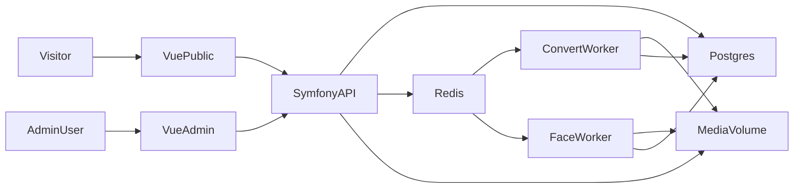

# Photo Gallery v4 — Design Spec

**Date:** 2026-07-19  
**Status:** Approved in brainstorming; awaiting implementation plan  
**Predecessor:** Gallery v3 (PHP + Backbone + MySQL) — reference only; no migration in MVP

## 1. Purpose

A public photo gallery with admin-only management. Visitors browse albums and photos. An admin uploads media, organizes albums, tags, people, and locations, and names people discovered by facial recognition.

Success for MVP means: hierarchical albums work publicly with correct visibility; uploads convert to AVIF and run face detection asynchronously; admin can name unknown face clusters and attach/remove people on photos.

## 2. Actors and access

| Actor | Capabilities |
|-------|----------------|
| Visitor | Browse `public` albums; open `unlisted` albums only via direct URL/slug; view photos, tags, people, locations |
| Admin | Full CRUD; upload; manage queue failures; name/merge people; edit photo metadata |

There are no visitor accounts. Admin authenticates against `AdminUser`.

### Album visibility

- **`public`**: listed on the public home and parent album views
- **`unlisted`**: not listed; reachable by known URL/slug; API returns 404 only if the slug is wrong (not if the client is unauthenticated)
- **`private`**: admin only; public API returns 404

## 3. Stack

| Layer | Choice |
|-------|--------|
| API | Symfony (PHP), JSON API |
| Database | PostgreSQL with **pgvector** |
| Queue | Redis + Symfony Messenger |
| Frontend | Vue 3, Composition API, TypeScript, Vite, Bun |
| Face worker | Python + InsightFace |
| Media conversion | Symfony Messenger worker + **libvips** (AVIF + thumbs) |
| Orchestration | **docker-compose** (default for local/dev) |

Monorepo layout (target):

```
/
  apps/api/          # Symfony
  apps/web/          # Vue (public + admin routes)
  apps/worker-faces/ # Python InsightFace consumer
  docker-compose.yml
  docs/
```

Public and admin share one Vue app with route guards for `/admin/*`.

## 4. Architecture



### docker-compose services

- `api` — Symfony behind **nginx + php-fpm**
- `frontend` — Vite/Bun in dev; built static assets served by nginx in prod profile
- `worker-convert` — Symfony Messenger consumer for `convert_media` (libvips in the PHP image)
- `worker-faces` — Python consumer for `detect_faces`
- `postgres` — image with pgvector
- `redis` — Messenger transport
- Shared named volume for media files

## 5. Domain model

### Album

- Tree via nullable `parent_id`
- Fields: `title`, `description`, `slug`, `visibility` (`public` | `unlisted` | `private`), `sort_order`, `cover_photo_id` (nullable), timestamps
- No soft-delete in MVP: **refuse delete** while the album has child albums or photos

### Photo

- Belongs to **exactly one** album (`album_id`)
- Fields: `title` (nullable), `taken_at` (nullable date/datetime), `location_id` (nullable), `width`, `height`
- Paths: `original_path`, `avif_path` (nullable until conversion), `thumb_paths` (JSON map of size → path)
- `processing_status`: `pending` → `converting` → `detecting` → `done` | `failed`
- `processing_error` (nullable text) when `failed`
- Public responses expose AVIF/thumb URLs only, never `original_path`

### Location

- Structured: `name`, `city`, `country`, `latitude`, `longitude`
- Photos reference `location_id`; admin UI includes map picker
- EXIF GPS may prefill location on convert when present; admin can override

### Tag

- `name`, unique slug
- N:N with photos via `photo_tag`

### Person

- `name` (nullable while unnamed), `is_named` (boolean), `avatar_face_id` (nullable FK to a representative `Face`)
- Unnamed clusters are `Person` rows with `is_named = false`
- Naming a cluster sets `name` and `is_named = true`
- Merging into an existing person reassigns all faces and deletes the empty cluster person
- Discard/ignore cluster: delete the unnamed `Person` and its `Face` rows (faces are removed from photos; admin can re-add people manually later)

### Face

- `photo_id`, bounding box (`x`, `y`, `width`, `height` in image coordinates), `crop_path`
- `person_id`, `confidence`
- `embedding` — pgvector column (dimension fixed by InsightFace model chosen at implementation; document in env, e.g. 512)
- Manual **remove** person from photo: delete that photo’s `Face` row(s) for that `person_id`
- Manual **add** person to photo: create a `Face` with bbox optional/null and **no embedding** (admin assertion; does not affect clustering until a detect pass exists). If a detected face for that person already exists, keep the detected row.

### AdminUser

- Email/username + password hash; **cookie session** auth for admin API (same-site with the Vue app)

## 6. Media pipeline

1. Admin uploads one or more files in an album context (browser multi-file).
2. API validates type/size, stores **original** on the media volume, creates `Photo` with `processing_status = pending`, enqueues `convert_media`.
3. **Convert worker**
   - Sets status `converting`
   - Produces AVIF master + AVIF thumbnails
   - Writes `avif_path`, `thumb_paths`, dimensions; may create/update `Location` / `taken_at` from EXIF
   - On success: status `detecting`, enqueue `detect_faces`
   - On failure: status `failed`, set `processing_error`; limited Messenger retries then stop
4. **Face worker** (Python / InsightFace)
   - Reads master AVIF (or original if AVIF missing)
   - Detects faces → embeddings + crops on disk
   - For each face, nearest-neighbor search in pgvector:
     - High similarity to a **named** person → assign `person_id`
     - High similarity to an **unnamed** cluster → assign that cluster
     - Else → create new `Person` with `is_named = false` and assign
   - On success: status `done`
   - On failure: status `failed` + error; admin may trigger **reprocess**

Public and admin UIs **serve AVIF** (and AVIF thumbs). Originals remain archived for re-encode/re-detect, not publicly linked.

Similarity thresholds live in environment config (e.g. `FACE_MATCH_THRESHOLD`, `FACE_CLUSTER_THRESHOLD`), not scattered literals.

## 7. API surface (conceptual)

All admin routes require authentication. Public routes filter by visibility.

| Area | Examples |
|------|----------|
| Auth | `POST /api/admin/login`, `POST /api/admin/logout`, `GET /api/admin/me` |
| Albums | CRUD + tree; public list/detail honor visibility |
| Photos | List by album; detail; admin upload, patch metadata, reprocess, delete |
| Tags | List, create, attach/detach on photo |
| Locations | Search/create, assign to photo |
| People | List named; list unnamed clusters; name; merge; photos by person |
| Faces | On photo detail; admin add/remove person on photo |

Errors: validation → 400; unauthenticated admin → 401; private/missing public resources → 404 (no existence leak for private).

## 8. UI

### Public

- Home: `public` albums (cover, title, count)
- Album: breadcrumb, sub-albums, photo grid
- Photo: AVIF, date, location + map when coordinates exist, tags, people; prev/next
- Filter pages: by person, tag, location

### Admin

- Login
- Album tree CRUD (visibility, cover, order)
- Multi upload with per-photo queue status
- Photo edit: tags, location (search + map), date, people add/remove
- **Unnamed people**: clusters with face crop gallery; name; merge into existing; discard/ignore cluster

### Out of scope (MVP)

- v3 data migration
- Visitor accounts / shared private albums with guests
- Mobile apps
- Comments
- GPU requirement (CPU-capable Docker is enough)

## 9. Error handling and resilience

- Invalid uploads rejected before enqueue
- Convert/detect failures → `failed` + message; bounded retries; admin reprocess
- Worker idempotency: if status is already `done`, skip detect unless admin **forced reprocess**, which deletes prior auto-detected faces for that photo and runs detect again (manual no-embedding faces are left untouched)
- Messenger: separate transports/queues for convert vs faces so a slow face backlog does not block conversion

## 10. Testing strategy

- **API (PHPUnit):** visibility rules; auth; upload creates photo + message; tag/person attach; merge person
- **Face worker:** unit tests with fixed embeddings for match / cluster / new-person decisions
- **Frontend (Vitest):** upload status list; unnamed-people name/merge flows (component-level)

No load/GPU benchmarks in MVP.

## 11. Security and privacy notes

- Admin credentials only for management; rate-limit login
- Do not expose originals or embeddings on public endpoints
- Face crops and person pages are public when the related photos are publicly reachable (same visibility rules as photos/albums)
- CORS and cookie settings appropriate for same-site or configured frontend origin

## 12. Future work (explicitly deferred)

- Import script from Gallery v3 (MySQL `album` / `foto`)
- Optional swap of face worker implementation behind the same job contract
- Purge policy for archived originals after N days
- Full-text search across titles/descriptions

## 13. Decision log

| Decision | Choice | Rationale |
|----------|--------|-----------|
| Audience | Public site + admin | Matches v3-style gallery |
| Hosting | VPS + Docker Compose | Needed for async workers |
| DB | PostgreSQL + pgvector | Embeddings and similarity search |
| Faces | Python InsightFace from day one | Better clustering quality than Bun/ONNX |
| Media format | AVIF via queue | Smaller delivery; originals kept for reprocess |
| Clustering | Auto-group unknowns | “Google Photos–like” naming UX |
| Visibility | public / unlisted / private | Unlisted share-by-link without listing |
| v3 data | Defer migration | Ship clean schema first |
